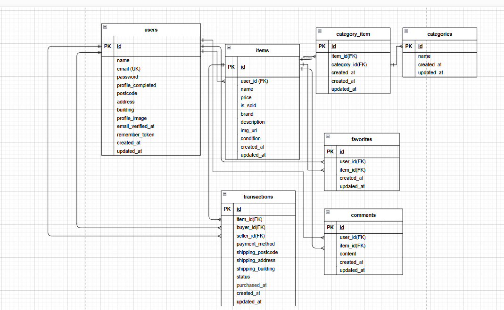

## プロジェクト概要
このプロジェクトは Laravel を用いたフリマアプリです。  
ユーザーは会員登録・ログイン後に商品を出品・購入することができ、  
メール認証・コメント・お気に入り（マイリスト）・検索・Stripe による決済機能などを備えています。  

## 環境構築
**Dockerビルド**
1. `git clone git@github.com:towa709/fleamarket.git`
2. `cd fleamarket`
3. DockerDesktopアプリを立ち上げる
4. `docker-compose up -d --build`

 上記の手順は任意の作業ディレクトリで実行可能です。  
   例: Linux/WSL 環境では `/home/ユーザー名/coachtech/fleamarket`、  
   Windows 環境では `C:\Users\ユーザー名\coachtech\fleamarket` など。

**Laravel環境構築**
1. `docker-compose exec php bash`
2. `composer install`
3. '.env.example'ファイルを コピーして'.env'を作成し、DBの設定を変更
4. `cp .env.example .env`

**注意**
初回ビルド及び.envコピー後、`src/` ディレクトリが root 権限になりますので、以下を必ずプロジェクトのルートディレクトリで実行して権限を修正してから保存してください。  
```bash
sudo chown -R $(whoami):$(whoami) .
```
``` text
DB_CONNECTION=mysql
DB_HOST=mysql
DB_PORT=3306
DB_DATABASE=laravel_db
DB_USERNAME=laravel_user
DB_PASSWORD=laravel_pass

MAIL_FROM_ADDRESS=example@test.com
MAIL_FROM_NAME="Fleamarket App"

STRIPE_KEY=your_stripe_public_key_here
STRIPE_SECRET=your_stripe_secret_key_here
# Stripe API キー（開発環境用のテストキーを設定）
STRIPE_KEY と STRIPE_SECRET は Stripe ダッシュボードから取得してください。ここではダミー値が入っています。
 Stripe テストキーはこちらから取得できます:  
  https://dashboard.stripe.com/test/apikeys
```

5. アプリケーションキーの作成
``` bash
docker-compose exec php bash
php artisan key:generate
```

6. マイグレーションの実行時に、MySQL の初期化エラー（--initialize specified but the data directory has files in it）が出ます。以下のコマンドを順にプロジェクトのルートディレクトリで実行してデータディレクトリを削除して再起動してから、マイグレーションを実行してください。
```bash
docker-compose down
sudo rm -rf ./docker/mysql/data/*
docker-compose up -d
```

``` bash
docker-compose exec php bash
php artisan migrate --seed
php artisan migrate:fresh --seed
```
※これでマイグレーションとデータ投入は完了です
##  ダミーデータ商品情報
- 腕時計  (id:1/¥15,000 / Rolax / 良好）
- HDD   (id:2/¥5,000 / 西芝 / 目立った傷や汚れなし）
- 玉ねぎ3束   (id:3/¥300 / なし / やや傷や汚れあり）
- 革靴  （id:4/¥4,000 / なし / 状態が悪い）
- ノートPC  （id:5/¥45,000 / なし / 良好）
- マイク  (id:6/¥3,000 / なし / 目立った傷や汚れなし）
- ショルダーバッグ  (id:7/¥8,000 / なし / やや傷や汚れあり）
- タンブラー  (id:8/¥500 / なし / 状態が悪い）
- コーヒーミル  (id:9/¥4,000 / Starbacks / 良好）
- メイクセット  (id:10/¥2,500 / なし / 目立った傷や汚れなし）

## ダミーデータユーザー情報
Seeder によって以下のユーザーが登録済みです。ログイン確認に使用してください。

- ユーザー⓵（id:1）
- 名前: 田中 奏多
- Email: tanaka@example.com
- Password: password123
- 郵便番号: 1000001
- 住所: 東京都千代田区千代田1-1
- 建物: 皇居前マンション101
- ダミーデータ商品出品: id:1~id:5

- ユーザー⓶（id:2）
- 名前: 佐藤 美咲
- Email: sato@example.com
- Password: password123
- 郵便番号: 1500001
- 住所: 東京都渋谷区神宮前1-2-3
- 建物: 渋谷ハイツ201
- ダミーデータ商品出品: id:6~id:10

- ユーザー⓷（id:3）
- 名前: 鈴木 大和
- Email: suzuki@example.com
- Password: password123
- 郵便番号: 5300001
- 住所: 大阪府大阪市北区梅田1-1-1
- 建物: 梅田タワー1503
- ダミーデータ商品出品: 無し。

7. ストレージのリンク作成（画像保存用）
```bash
php artisan storage:link
```
8.  アクセス時に Permission denied エラーが出る場合は以下を実行してください。（http://localhost）
```bash
docker-compose exec php bash
chown -R www-data:www-data storage bootstrap/cache
chmod -R 775 storage bootstrap/cache
```

9. テスト用データベースの作成  
テストは `laravel_test` データベースを使用します。  
初回のみ以下を実行して DB を作成してください。

```bash
docker-compose exec mysql bash
mysql -u root -p
```

MySQL コンソールに入ったら以下を入力：
```bash
CREATE DATABASE IF NOT EXISTS laravel_test CHARACTER SET utf8mb4 COLLATE utf8mb4_unicode_ci;
GRANT ALL PRIVILEGES ON laravel_test.* TO 'laravel_user'@'%';
FLUSH PRIVILEGES;
EXIT;
```
これでテスト用 DB が準備されます。

10. テストの実行
```bash
php artisan test --env=testing
```
全 44 件のテストが PASS すれば、環境構築は正常に完了です。

### 実施内容
・各機能ごとに Feature テスト を作成
・会員登録・ログイン・ログアウト
・メール認証（認証メール送信／認証リンクによる認証完了／未認証時のアクセス制御）
・商品一覧／商品詳細／商品出品／検索
・コメント機能／お気に入り（マイリスト）機能
・購入処理（支払い方法・送付先住所・購入完了処理）
・プロフィール表示・編集

※メール認証について
・Laravel 標準のメール認証機能（MustVerifyEmail / Registered イベント / VerifyEmail 通知）を利用
・開発環境では MailHog を使用し、メール送信・認証リンク動作を確認
・会員登録後に認証メールを送信 → リンククリックで email_verified_at が更新され、商品一覧画面へ遷移

※決済処理について
・Stripe Checkout を利用し、クレジットカード・コンビニ払いに対応
・購入時に配送先住所を入力／変更可能
・決済成功後に transactions テーブルへ購入履歴を保存し、商品を is_sold = true に更新
・購入完了後はトップページへリダイレクトし、正常動作を確認済み

※テスト結果
・php artisan test --env=testing を実行
・合計 44 件のテストケースを作成し、すべて PASS

### 結論
仕様書に記載された全ての要件を満たしている
PHPUnit テストによって機能の正常動作を確認済み
特にメール認証と Stripe 決済処理について、仕様通りのフローを実装・確認できた

### チャット機能（取引メッセージ）
本アプリでは、購入者と出品者が直接やり取りできる
取引チャット機能 を実装しています。
・機能一覧
・メッセージ送信（テキスト）
・画像送信（プレビュー付き）
・自動スクロール・自動更新（2秒ごと）
・メッセージの編集・削除
・草稿保存（localStorage）
・未読カウント表示
・既読処理
・サイドバーに取引一覧 + 未読バッジ
・最新メッセージ順ソート
・評価モーダルとの連動
・主な API エンドポイント
- GET    /api/chat/list                     取引一覧
- GET    /api/chat/partner/{id}             相手ユーザー情報取得
- GET    /api/chat/{id}                     メッセージ一覧取得
- POST   /api/chat/{id}                     メッセージ送信
- POST   /api/chat/{id}/read                既読処理
- PATCH  /api/chat/message/{id}             メッセージ編集
- DELETE /api/chat/message/{id}             メッセージ削除
保存場所について
画像：storage/app/public/chat_images/
プロフィール画像：storage/app/public/profiles/
取引の商品画像：storage/app/public/items/

注意事項
必ず php artisan storage:link を実行してください
未実行の場合、プロフィール画像・商品画像・チャット画像が表示されません。
自動更新は 2 秒ごとに動作していますが、
メッセージ編集中は自動更新が停止します（内容保護のため）。

## ER図



## URL
- 開発環境：http://localhost
- phpMyAdmin: http://localhost:8080
- MailHog: http://localhost:8025

## 使用技術
- Laravel 11
- PHP 8.2
- MySQL 8.0
- Docker / docker-compose
- Nginx
- MailHog
- phpMyAdmin
- Stripe Checkout
